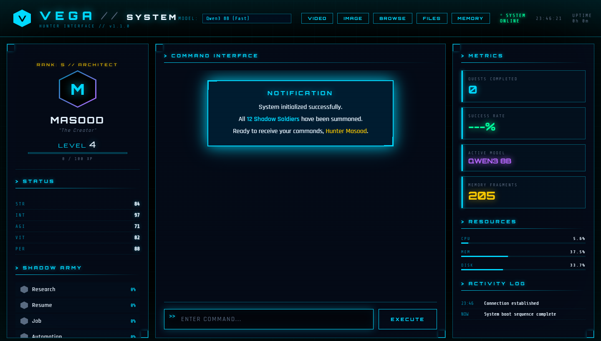
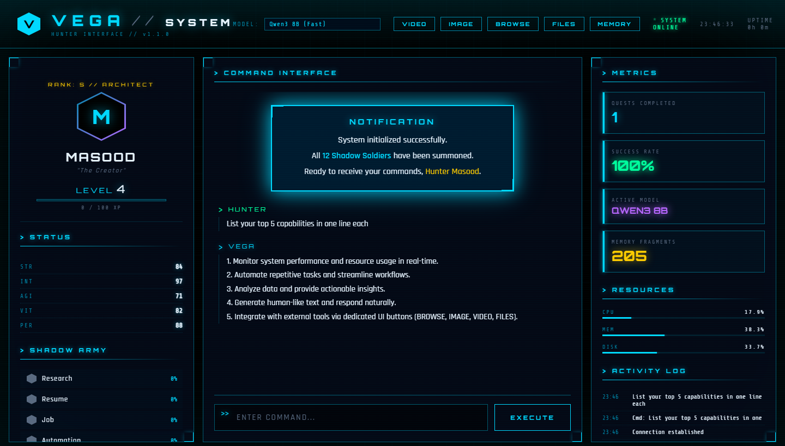
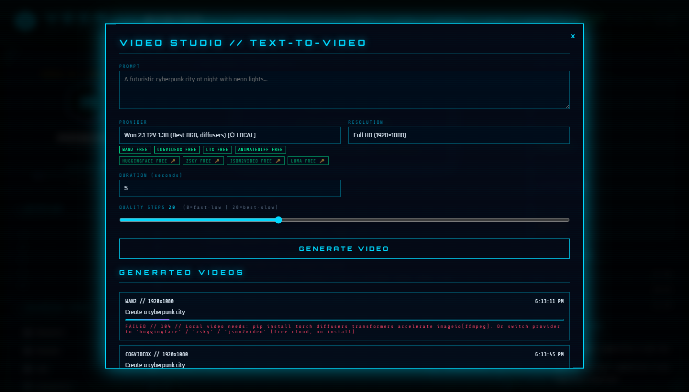
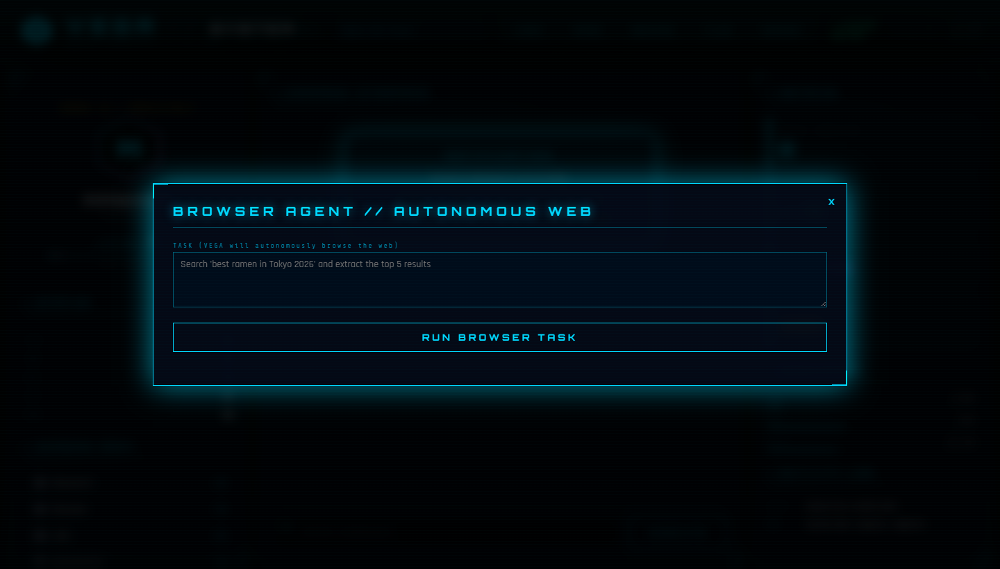
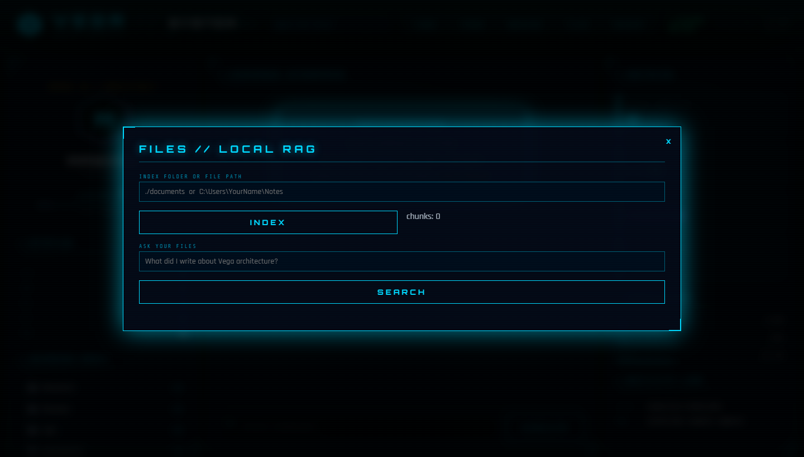

<div align="center">

```
 V   V  EEEEE  GGGG   AAA
 V   V  E      G      A   A
 V   V  EEEE   G  GG  AAAAA
  V V   E      G   G  A   A
   V    EEEEE  GGGG   A   A
```

# VEGA AI — Autonomous AI Operating System

**The world's most powerful 100% FREE, fully local AI assistant.**  
Multi-agent system • Solo Leveling RPG HUD • Real-time streaming • Text-to-video • Browser automation

[](https://python.org)
[](https://fastapi.tiangolo.com)
[](https://ollama.com)
[](LICENSE)
[](https://github.com/masood-ahmed-k/vega-ai)

</div>

---

## What is VEGA?

VEGA is an **autonomous AI operating system** that runs entirely on your local machine — no API keys, no subscriptions, no cloud required. It combines a multi-agent AI backend with a Solo Leveling–inspired RPG HUD, giving you a mission-control interface for real tasks: browsing the web, writing code, generating images & videos, managing files, and more.

> **Hardware tested on:** RTX 4060 8GB · 32GB RAM · i7-13650HX  
> Works on any modern GPU with 6GB+ VRAM.

---

## Screenshots

### Main HUD — Shadow Army & Command Interface


### Live Chat — Real-time Token Streaming


### Video Studio — 8 FREE Providers (4 Local + 4 Cloud)


### Browser Agent — Autonomous Web Browsing


### Files & RAG — Ask Questions About Your Documents


---

## Features

### 🤖 Multi-Agent System (Shadow Army)
| Agent | What it does |
|---|---|
| **Planner** | Master orchestrator — decomposes tasks across all agents |
| **Research** | Deep web research & synthesis |
| **Code** | Writes, debugs, and explains code |
| **Browser** | Autonomous Playwright web browsing |
| **Image** | Local image generation (SDXL Turbo / Flux.1) |
| **Video** | Text-to-video via 8 FREE providers |
| **Resume** | ATS-optimized resume & cover letter builder |
| **Job** | Job search, tracking & career advice |
| **Study** | Learning plans, flashcards & progress tracking |
| **Email** | Draft emails and manage communications |
| **Finance** | Budget tracking & expense summaries |
| **Health** | Break reminders, posture checks & wellness |
| **Memory** | Long-term knowledge & preference storage |
| **System Monitor** | CPU/RAM/disk monitoring & alerts |

### ⚡ Real-Time Token Streaming
Responses stream token-by-token — first token appears in ~3 seconds, not 60. Built on Ollama's streaming API with WebSocket delivery to the HUD.

### 🎬 Text-to-Video (8 FREE Providers)
| Provider | Type | VRAM |
|---|---|---|
| **Wan 2.1 T2V-1.3B** | Local GPU | 8GB |
| **CogVideoX-2B** | Local GPU | 6GB |
| **LTX-Video 0.9** | Local GPU | 8GB |
| **AnimateDiff** | Local GPU | 6GB |
| **HuggingFace API** | Cloud Free | — |
| **ZSky AI** | Cloud Free | — |
| **JSON2Video** | Cloud Free | — |
| **Luma Dream Machine** | Cloud Free (5/mo) | — |

### 🖼️ Image Generation
- **SDXL Turbo** — 1-step local generation, no login needed
- **Flux.1-schnell** — State-of-the-art local quality (requires HF login)
- **HuggingFace API** — Cloud fallback

### 🌐 Browser Agent
Playwright-powered autonomous browser — fills forms, scrapes pages, clicks buttons, takes screenshots. VEGA drives Chrome so you don't have to.

### 📚 RAG — Ask Your Documents
Index any folder of PDFs, TXTs, or code files. Ask VEGA questions about them using local Ollama embeddings (`nomic-embed-text`). No cloud, no cost.

### 🧠 Persistent Memory
- **Episodic** — remembers past conversations via ChromaDB vector search
- **Procedural** — preferences, XP, level stored in SQLite
- **Knowledge Graph** — entity & relationship tracking

### 🎮 Solo Leveling RPG HUD
- **Hunter Card** — your character with rank, level & XP bar
- **Shadow Army** — live agent status & success rates
- **Metrics Panel** — quests completed, success rate, active model, memory fragments
- **Resources** — real-time CPU / RAM / disk bars
- **Activity Log** — timestamped event feed
- **Model Switcher** — swap AI models from the HUD dropdown
- **XP System** — earn XP on every task, level up automatically

### 🔌 MCP Server
Expose VEGA's agents as tools to **Claude Desktop** or any MCP client. Research, code, memory, browser, video — all available via MCP.

### 🧬 Self-Evolution
VEGA tracks repeated requests and auto-generates new skills after 3 similar tasks. The evolution engine writes Python skill files on its own.

---

## Quick Start

### 1. Prerequisites

| Tool | Link |
|---|---|
| Python 3.10+ | https://python.org |
| Ollama | https://ollama.com |
| Git | https://git-scm.com |

### 2. Clone & Install

```bash
git clone https://github.com/masood-ahmed-k/vega-ai.git
cd vega-ai
```

**Windows (double-click):**
```
scripts\install.bat
```

**Mac/Linux (manual):**
```bash
python -m venv venv
source venv/bin/activate
pip install -r requirements.txt
```

### 3. Pull the AI Model

```bash
# Fast & efficient (recommended for 8GB VRAM)
ollama pull qwen3:8b

# Balanced quality/speed (MoE — uses less VRAM than size suggests)
ollama pull qwen3:30b-a3b

# Maximum quality (needs 20GB+ RAM)
ollama pull qwen3:32b
```

### 4. Start VEGA

**Windows:**
```
scripts\start.bat
```

**Mac/Linux:**
```bash
source venv/bin/activate
python main.py
```

Open your browser at: **http://localhost:8888**

---

## Configuration

All settings live in `config/settings.yaml`. The most important ones:

### Your Name
```yaml
system:
  user: "Hunter"   # Change this to your name — shows up in the HUD
```

### AI Model
```yaml
models:
  default_local: "qwen3:8b"   # qwen3:8b | qwen3:30b-a3b | qwen3:32b
  ollama_host: "http://localhost:11434"
```

### Hardware Tuning (GPU)
```yaml
models:
  hardware:
    num_gpu: 99        # Push all layers to GPU
    num_ctx: 8192      # Context window size
    num_thread: 14     # CPU threads (set to your core count)
    num_batch: 512     # Batch size
    keep_alive: "30m"  # Keep model hot in VRAM
    preload_on_start: true  # Warm up model on boot
```

### Video Generation
```yaml
video:
  default_provider: "wan2"   # wan2 | cogvideox | ltx | animatediff | huggingface | zsky
  default_resolution: "1920x1080"
  default_duration: 5
```

### Image Generation
```yaml
image:
  default_provider: "sdxl_turbo"   # sdxl_turbo | flux_schnell | huggingface
```

### Browser Agent
```yaml
browser:
  headless: false   # true = invisible | false = watch VEGA browse
```

### Memory & RAG
```yaml
memory:
  working_memory_size: 100
  chat_persistence:
    enabled: true
  rag:
    enabled: true
    embedding_model: "nomic-embed-text"   # free Ollama embedding
    chunk_size: 512
```

---

## Optional: API Keys (for cloud features)

Copy `.env.example` to `.env` and add keys for any cloud providers you want:

```bash
cp .env.example .env
```

```env
# Optional — only needed for cloud providers
HF_API_KEY=hf_...          # HuggingFace (video/image cloud fallback)
ZSKY_API_KEY=...            # ZSky video
JSON2VIDEO_API_KEY=...      # JSON2Video
LUMA_API_KEY=...            # Luma Dream Machine

# Optional — for cloud AI models
OPENAI_API_KEY=sk-...
ANTHROPIC_API_KEY=sk-ant-...
GOOGLE_API_KEY=...
```

> Everything works **without any API keys** using local Ollama models.

---

## Optional Installs

Run from the `scripts/` folder for extra capabilities:

| Script | What it enables |
|---|---|
| `install_browser.bat` | Playwright browser agent (Chromium) |
| `install_video_deps.bat` | Local GPU video generation (torch + diffusers) |
| `install_voice.bat` | Voice wake word + speech-to-text |
| `install_mcp.bat` | MCP server for Claude Desktop |
| `install_qwen3.bat` | Pull all Qwen3 model sizes |

---

## REST API

VEGA exposes a full REST API at `http://localhost:8888/api/`:

```bash
# Run any task
POST /api/task
{"task": "Research the latest AI papers on reasoning"}

# List agents
GET /api/agents

# System status
GET /api/status

# Generate video
POST /api/video/generate
{"prompt": "A dragon flying over a neon city", "provider": "wan2"}

# Generate image
POST /api/image/generate
{"prompt": "Cyberpunk samurai at sunset"}

# Browser task
POST /api/browser/run
{"task": "Go to news.ycombinator.com and summarize the top 5 posts"}

# Search memory
GET /api/memory/chats/search?query=python&n=10

# Index files for RAG
POST /api/rag/index
{"path": "/home/you/Documents"}

# Search indexed files
POST /api/rag/search
{"query": "What are my project requirements?", "k": 5}

# Switch AI model
POST /api/models/switch
{"model": "qwen3:30b-a3b"}
```

### WebSocket (Real-time Streaming)
```javascript
const ws = new WebSocket('ws://localhost:8888/ws');
ws.send(JSON.stringify({ type: 'command', task: 'Write a Python web scraper' }));

ws.onmessage = (e) => {
  const msg = JSON.parse(e.data);
  if (msg.type === 'stream')   process.stdout.write(msg.data.token); // live tokens
  if (msg.type === 'response') console.log('Done:', msg.data);
};
```

---

## Project Structure

```
vega-ai/
├── main.py                    # Entry point — boots everything
├── config/
│   └── settings.yaml          # All configuration
├── agents/                    # 14 specialized AI agents
│   ├── planner.py             # Master orchestrator
│   ├── research.py
│   ├── browser.py             # Playwright automation
│   ├── video.py               # Text-to-video
│   ├── image.py               # Image generation
│   └── ...
├── api/
│   └── __init__.py            # FastAPI REST + WebSocket server
├── core/
│   ├── command_core.py        # Central brain — connects all subsystems
│   ├── evolution.py           # Self-improvement engine
│   └── event_bus.py           # Async pub/sub
├── models/
│   └── router.py              # Multi-model router with streaming
├── memory/
│   ├── __init__.py            # Memory manager (episodic + procedural + KG)
│   └── rag.py                 # Local file RAG with Ollama embeddings
├── skills/
│   └── builtins/              # Pre-built skill modules
├── ui/
│   └── templates/hud.html     # Solo Leveling RPG HUD (single HTML file)
├── scripts/
│   ├── start.bat              # One-click launch (Windows)
│   ├── install.bat            # Full auto-installer
│   └── install_video_deps.bat # GPU video dependencies
├── docs/
│   └── screenshots/           # HUD screenshots
└── mcp_server.py              # MCP server for Claude Desktop
```

---

## MCP Integration (Claude Desktop)

Add to your `claude_desktop_config.json`:

```json
{
  "mcpServers": {
    "vega": {
      "command": "python",
      "args": ["C:/path/to/vega-ai/mcp_server.py"],
      "env": {}
    }
  }
}
```

VEGA's agents (research, code, memory, browser, video, image, RAG) become tools inside Claude Desktop.

---

## Troubleshooting

**"All models failed" / no response**
```bash
ollama serve        # make sure Ollama is running
ollama list         # verify qwen3:8b is downloaded
```

**Video generation fails**
```
scripts\install_video_deps.bat   # installs torch + diffusers
```

**Browser agent fails**
```bash
pip install playwright
playwright install chromium
```

**Port 8888 already in use**
```
scripts\restart.bat   # kills old process and restarts
```

**First response is slow (>10s)**  
Normal on cold start — model loads into VRAM. Enable `preload_on_start: true` in settings.yaml to pre-warm the model on every boot.

---

## Tech Stack

| Layer | Technology |
|---|---|
| AI Models | Qwen3 8B / 30B-A3B / 32B via Ollama |
| Backend | FastAPI + Uvicorn + WebSocket |
| Streaming | Ollama streaming API → async generator → WebSocket |
| Memory | ChromaDB (vector) + SQLite (procedural) + NetworkX (KG) |
| Browser | Playwright (Chromium) |
| Image Gen | diffusers — SDXL Turbo / Flux.1-schnell |
| Video Gen | diffusers — Wan2, CogVideoX, LTX, AnimateDiff |
| RAG | nomic-embed-text (Ollama) + HNSW vector index |
| HUD | Vanilla HTML/CSS/JS — Solo Leveling RPG theme |
| MCP | Model Context Protocol (stdio transport) |

---

## License

MIT — free to use, modify, and distribute.

---

<div align="center">

**Built with** ❤️ **and zero paid APIs.**

[⭐ Star this repo](https://github.com/masood-ahmed-k/vega-ai) · [🐛 Report a bug](https://github.com/masood-ahmed-k/vega-ai/issues) · [💡 Request a feature](https://github.com/masood-ahmed-k/vega-ai/issues)

</div>
